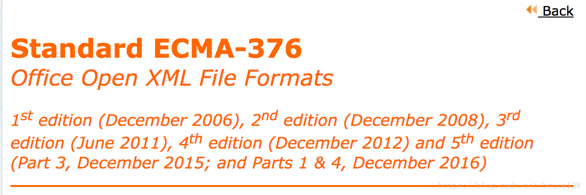
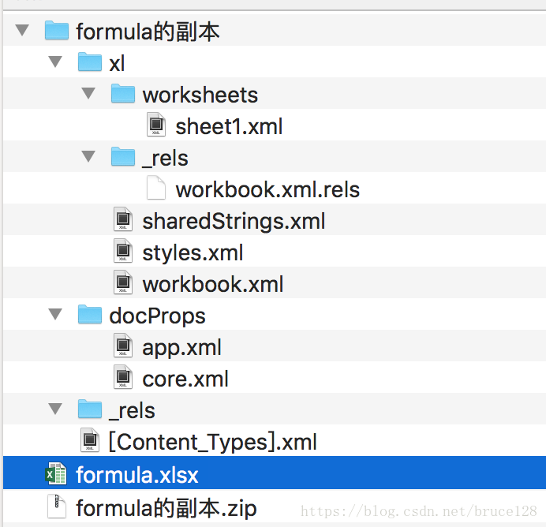

# Office Open XML 单元格格式详解

> 版权声明：本文为博主原创文章，未经博主允许不得转载。
> https://blog.csdn.net/bruce128/article/details/79932230

用SAX解析excel文件，仅提取数据部分。`SAX`技术过于底层，直接读XML文件，并要求开发者对于XML的格式了如指掌。
[POI](http://poi.apache.org/index.html)框架官方给的[用SAX解析的demo](http://poi.apache.org/components/spreadsheet/examples.html)里仅解析了`字符串`和`数字类型`的单元格，其他类型的单元格并未解析。
此外，excel文件里的xml信息很多，如果开发者想解析其他的内容呢？

## 一、ECMA-376标准

  Office 2007以后，微软公司使用`Office Open XML`作为office文件的技术规范。`Office Open XML`现已成为国际文档格式标准ECMA家族成员——ECMA-376。`ECMA-376标准`从2006年的第一版到现在已经发展到了第五版。 [ECMA-376官网](http://www.ecma-international.org/publications/standards/Ecma-376.htm)  给出了`Office Open XML 文件格式`的详细技术规范。本文主要就第五版给出的技术规范文档做些梳理和翻译。



## 二、excel的文件结构

  excel文件其实是xml文件集合的一个zip包。把excel文件的后缀“xlsx”改成“zip”，解压后就可以看出excel的文件组织结构: 



顶级的文件(比如说formula.xlsx)被叫做package(Open Packaging Conventions). 因为包(package)是被实现为一个标准ZIP包的, 它自动地提供了对文档的压缩。在包中有两种内部的组件: parts和items. 总的来说, parts包括文档内容和一些含有用来描述parts的元数据的items. Items可以被进一步的细分为relationship items和content-type items.

### exel文件结构的文本形式展示如下：

```
_rels/.rels
[Content_Types].xml
docProps/app.xml
docProps/core.xml
xl/sharedStrings.xml
xl/styles.xml
xl/workbook.xml
xl/_rels/workbook.xml.rels
xl/worksheets/sheet1.xml
```

### zip包里有两个共享资源池类型的文件：

* sharedStrings.xml ：存储的是共享字符串常量池。
* styles.xml ：存储的是共享样式表。

## 三、单元格的格式类型

技术规范的第18.18.11章节给出了单元格类型(Cell Type)的详细说明。PS: 本文所有的测试数据均由Mac版的Excel2016 生成。Win下可能会略有差别。

### 1. 布尔类型

类型值为 “b”， true映射成数字1。

```XML
<c r="C1" t="b">
    <v>1</v>
</c>
```

### 2. 日期类型

类型值为“d”,日期类型的值是个浮点数，poi包有工具类将这个浮点数转成日期的工具方法。
属性`s`代表的是样式

```XML
<c r="B1" s="1">
    <v>43203.396180555559</v>
</c>
```

### 3. 错误类型

类型值为“e”,表示这个单元格包含一个错误。

```XML
<row r="1">
    <c r="A1" t="e"/>
</row>
```

### 4. 内联字符串类型

类型值为“inlineStr”,表示这个单元格的字符串并没有用共享字符串池子的值。

```XML
<c r="A2" t="inlineStr">
    <is>
        <t>SXSSFWorkbook_1_0</t>
    </is>
</c>
```

### 5. 数字类型

类型值为“n”。数字类型是默认类型，属性`t`没有值

```XML
<row r="1">
    <c r="A1" t="e"/>
</row>
```

### 6. 共享字符串类型

类型值为“s”，v节点的值可以看做一个指针，指向共享字符串池子（对应文件sharedStrings.xml ）的字符串索引。

```XML
<c r="D1" t="s">
    <v>0</v>
</c>
```

### 7. 公式类型

类型值为“str”, 这个公式是对e求10次方的幂函数。

```XML
<c r="C6" s="1" vm="15" t="str">
    <f>EXP(10)</f>
    <v>22026.465794806718</v>
</c>
```

## 四、单元格c的属性分类

在sheetN.xml文件中，`c`节点代表一个单元格。

1. 坐标属性

属性名为`r`（Reference），属性值为该单元格在表格中的坐标位置，如“A1”， “C9”

2. 样式索引属性

属性名为`s` (Style Index)，属性值是个数字，是样式索引表（对应文件styles.xml ）的下标。

> The index of this cell’s style. Style records are stored in the Styles Part.

3. 单元格数据类型属性
属性名为 `t` (Cell Data Type)，属性值代表当前单元格的类型。类型枚举前文已经详细阐述， 这里不再赘述。

> An enumeration representing the cell’s data type.

## 五、小结

  有了上文的针对单元格的xml格式详解，再用SAX解析excel文件的时候，对数据类型、样式等数据的解析就不会摸不着头脑光靠猜了。